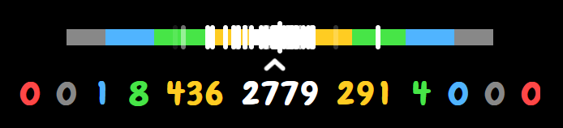
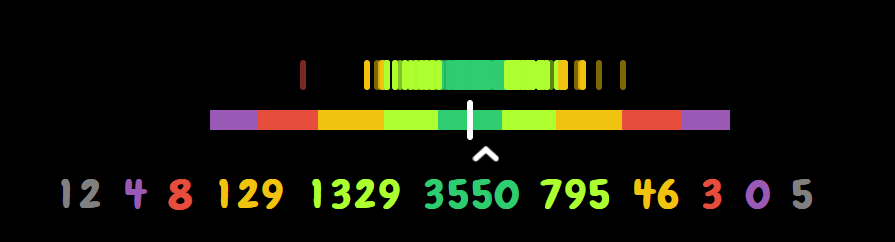

<div align="center">

# Judgement Visualizer

**A real-time hit error visualizer for osu! powered by [tosu](https://github.com/tosuapp/tosu)**


Visualizes **hit error ticks** on a timing bar and tracks **early / late counts** per judgement tier in real time.  
Works as an in-game overlay or OBS browser source.

<br>




Inspired by the [Judgement Visual mod from AdofaiTweaks](https://github.com/PizzaLovers007/AdofaiTweaks/).

</div>

---

## Features

- **Hit error ticks**  appear and fade out on a live timing bar after every note hit
- **Color-coded timing windows**  scale dynamically with OD and active mods
- **Median offset arrow**  tracks your rolling average hit position
- **Early / Late hit counts**  displayed per judgement tier in real time
- **Full mod support**  Hard Rock, Easy, and rate-changing mods (DT / HT)
- **osu! standard, Taiko, and Mania**  all game modes supported
- **Fully configurable**  all visual properties exposed through tosu's settings panel

---

## Installation

1. **Download** this repository as a ZIP (or `git clone` it)
2. **Place** the folder inside your tosu `/static` directory
3. **Open** the tosu overlay manager and select **Judgement Visualizer** from the list
4. **Add** the overlay URL as a Browser Source in OBS, or use it as an in-game overlay

> **Tip:** Set the browser source to **1000×250** with a transparent background for best results.

---

## Settings

<details>
<summary><b>Colors</b></summary>

| Setting | Default | Description |
|---|---|---|
| MAX (300g) Color | `#ffffff` | Color for MAX / 300g hits (Mania only) |
| Perfect (300) Color | `#ffcc22` | Color for 300 hits |
| Great (200) Color | `#47e547` | Color for 200 hits |
| Good (100) Color | `#50b4ff` | Color for 100 hits |
| Bad (50) Color | `#888888` | Color for 50 hits |
| Miss (0) Color | `#ff4747` | Color for misses |
| Use Dynamic Tick Color | `false` | Color each tick by its hit window; uncheck to use Solid Tick Color |
| Solid Tick Color | `#ffffff` | Used when Dynamic Tick Color is disabled |

</details>

<details>
<summary><b>Hit Error Ticks</b></summary>

| Setting | Default | Description |
|---|---|---|
| Tick Width | `6 px` | Width of each hit error tick |
| Tick Height | `30 px` | Height of each hit error tick |
| Tick Y-Offset | `0 px` | Move ticks up (negative) or down (positive) |
| Tick Hold Duration | `1000 ms` | How long a tick stays fully visible |
| Tick Fade Duration | `1000 ms` | Duration of the fade-out animation |

</details>

<details>
<summary><b>Center Line</b></summary>

| Setting | Default | Description |
|---|---|---|
| Center Line Width | `6 px` | Width of the center indicator line |
| Center Line Height | `40 px` | Height of the center indicator line |

</details>

<details>
<summary><b>Timing Bar</b></summary>

| Setting | Default | Description |
|---|---|---|
| Background Bar Height | `20 px` | Height of the colored timing window bar |
| Hide Hit Error Bar | `false` | Hide the colored timing bar and hit ticks |

</details>

<details>
<summary><b>Hit Counts</b></summary>

| Setting | Default | Description |
|---|---|---|
| Show Hit Counts | `true` | Display early / late count numbers |
| Hit Counts Font Size | `40 px` | Font size of the hit count numbers |
| Hit Counts Y-Offset | `0 px` | Move hit counts down (positive) or up (negative) |
| Hit Counts Position on Top | `false` | Show hit counts above the bar instead of below |

</details>

<details>
<summary><b>Median Arrow</b></summary>

| Setting | Default | Description |
|---|---|---|
| Hide Hit Error Arrow | `false` | Hide the median hit error arrow |
| Arrow Position on Top | `false` | Show arrow above the bar instead of below |

</details>

<details>
<summary><b>Background</b></summary>

| Setting | Default | Description |
|---|---|---|
| Show Bar Background | `false` | Draw a background box behind the visualizer |
| Background Color | `#000000` | Color of the background box |
| Background Opacity | `50 %` | `0` = transparent · `100` = solid |
| Background Padding | `10 px` | Extra width / height added around the ticks and bar |

</details>

---

## How It Works

The overlay connects to tosu over WebSocket on two endpoints. `/websocket/v2` provides game state, mode, OD, mods, and official hit counts. `/websocket/v2/precise` provides raw hit error values in milliseconds.

Each hit error is plotted as a tick at a horizontal offset proportional to its ms value. A pool of 250 tick elements is reused to avoid DOM allocation during play. The arrow tracks the rolling median of the last 100 hit errors.

Hit counts use a strict monotonic distribution algorithm to reconcile early / late splits from the precise endpoint with official totals from v2, preventing the display from jumping backward on out-of-order data.

### Timing Window Formula

| Mode | Formula |
|---|---|
| osu! standard | `80 - 6 × OD` |
| Taiko | `50 - 3 × OD` |
| Mania | `16` (fixed) |

> EZ halves OD · HR multiplies OD by 1.4 (capped at 10) before the formula is applied.

---

## File Structure

```
judgement-visualizer/
 index.html           # Overlay HTML
 main.css             # Styles & CSS variables
 main.js              # WebSocket logic & rendering
 settings.json        # Plugin settings (read by tosu)
 metadata.txt         # Plugin metadata
```

---

## Compatibility

| | |
|---|---|
| **Overlay tool** | [tosu](https://github.com/tosuapp/tosu) (WebSocket v2 + v2/precise) |
| **Game modes** | osu! standard · Taiko · Mania |
| **Mods** | EZ · HR · DT / HT (rate-corrected) |
| **OBS** | Browser Source, 1000×250, transparent |

---

## Credits

- **Author**  Albert
- **Inspired by**  [AdofaiTweaks – Judgement Visual](https://github.com/PizzaLovers007/AdofaiTweaks/) by PizzaLovers007
- **Based on**  [breadles](https://github.com/breadles5) original concept
- **Powered by**  [tosu](https://github.com/tosuapp/tosu)
